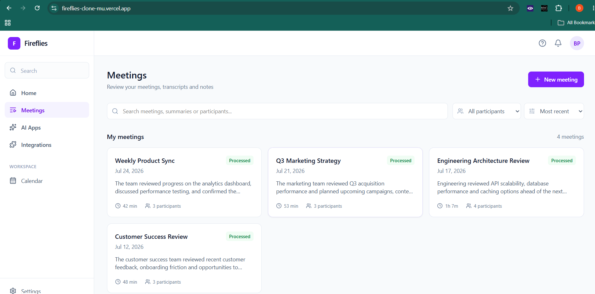
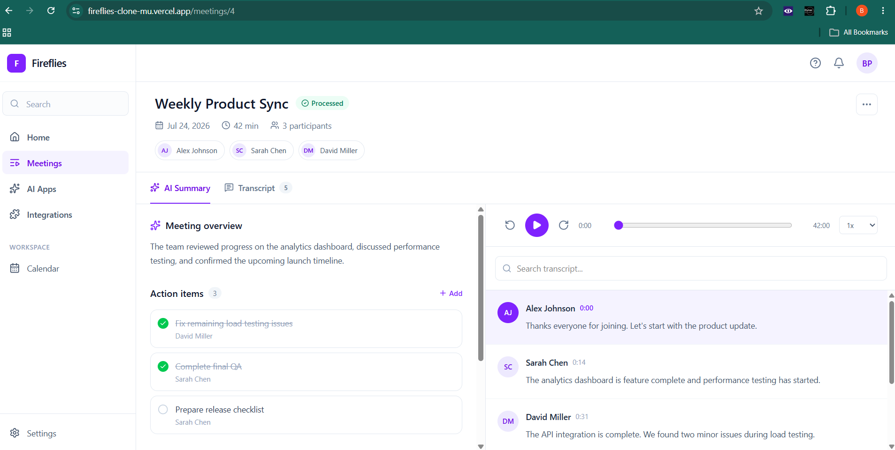
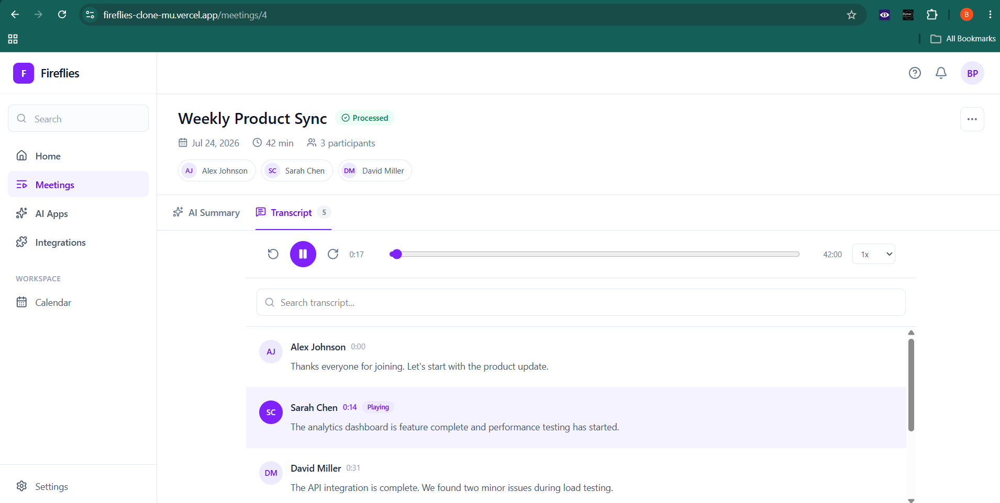

# Fireflies.ai Clone

A full-stack meeting intelligence application inspired by Fireflies.ai.

The application provides a central workspace for managing meetings, reviewing summaries, exploring speaker-attributed transcripts, tracking action items, and navigating meeting topics.

It is built with **Next.js + TypeScript** on the frontend and **FastAPI + SQLAlchemy** on the backend, with **PostgreSQL** providing persistent production storage.

---

## Live Demo

**Frontend**

https://fireflies-clone-mu.vercel.app

**Backend API**

(https://fireflies-clone-wkk2.onrender.com/)

**Interactive API Documentation**

(https://fireflies-clone-wkk2.onrender.com/)/docs

**GitHub Repository**

(https://github.com/Brij881/fireflies-clone/)

> The application is hosted using free-tier infrastructure. The backend may take a short time to wake up after a period of inactivity.

---

## Screenshots

### Meeting Dashboard

The dashboard provides a searchable and filterable overview of meetings, including meeting summaries, dates, durations, participants, and processing status.



### Meeting Workspace

Each meeting has a dedicated workspace containing its summary, topics, participants, action items, and transcript.



### Interactive Transcript

Transcripts are divided into speaker-attributed, timestamped segments and support searching and playback synchronisation.



---

## Features

### Meeting Dashboard

The main dashboard provides an overview of all available meetings.

Users can:

- View all meetings
- Search meetings by title
- Search meeting summaries
- Search by participant name
- Filter meetings by participant
- Sort meetings by most recent
- Sort meetings by oldest
- Sort meetings alphabetically
- View meeting duration
- View participant count
- Create new meetings
- Edit existing meetings
- Delete meetings

Search and participant filters can be combined to narrow results further.

---

### Meeting Workspace

Each meeting has a dedicated workspace containing structured meeting information.

The workspace includes:

- Meeting title
- Meeting date
- Duration
- Participants
- Meeting summary
- Topics discussed
- Action items
- Speaker-attributed transcript

---

### Interactive Transcript

Meeting transcripts are stored as individual timestamped segments.

Each transcript segment contains:

- Speaker
- Start time
- End time
- Transcript text
- Segment order

The transcript interface supports:

- Speaker attribution
- Timestamp navigation
- Transcript searching
- Search-result highlighting
- Active-segment highlighting
- Clicking a segment to seek playback
- Synchronisation between playback time and transcript position

---

### Playback Controls

The meeting workspace contains a simulated playback system based on transcript timing.

Users can:

- Play and pause
- Seek through the meeting timeline
- Click transcript timestamps to change playback position
- Change playback speed
- Follow the currently active transcript segment

The shared playback state enables bidirectional interaction:

```text
Transcript click
      │
      ▼
Update playback position
      │
      ▼
Highlight active transcript segment
```

---

### Action Items

Action items can be managed directly from a meeting.

Users can:

- Create action items
- Assign action items
- Edit action items
- Mark items complete
- Mark items incomplete
- Delete action items

Changes are persisted through the FastAPI backend and PostgreSQL database.

---

### Meeting Creation

Users can create meetings directly from the dashboard.

Meeting information can include:

- Title
- Date
- Duration
- Participants
- Summary
- Transcript

---

### Transcript Import

Transcripts can be added by:

- Pasting transcript text
- Uploading a `.txt` file

The parser supports speaker-attributed transcripts such as:

```text
Alex: Thanks everyone for joining.
Sarah: Let's review the launch timeline.
David: The API integration is complete.
```

Timestamped transcripts are also supported:

```text
[00:00] Alex: Thanks everyone for joining.
[00:14] Sarah: Let's review the launch timeline.
[00:31] David: The API integration is complete.
```

Parsed transcript entries are converted into structured transcript segments before being stored by the backend.

---

## Demo Data

The deployed application contains sample meetings covering different types of team discussions.

Examples include:

- Weekly Product Sync
- Q3 Marketing Strategy
- Engineering Architecture Review
- Customer Success Review

The demo meetings contain realistic:

- Participants
- Summaries
- Transcript segments
- Topics
- Action items

This allows search, filtering, sorting, transcript navigation, and action-item functionality to be tested immediately.

---

## Tech Stack

### Frontend

- Next.js
- React
- TypeScript
- Tailwind CSS
- Lucide React

### Backend

- Python
- FastAPI
- SQLAlchemy
- Pydantic
- Uvicorn

### Database

**Production**

- PostgreSQL

**Local development**

- SQLite fallback

### Deployment

- Vercel — Next.js frontend
- Render — FastAPI backend
- Render PostgreSQL — persistent production database

---

## Architecture

```text
┌─────────────────────────────────┐
│                                 │
│        Next.js Frontend         │
│             Vercel              │
│                                 │
│  Dashboard / Meeting Workspace  │
│  Search / Filters / Transcript  │
│        Action Item UI           │
│                                 │
└────────────────┬────────────────┘
                 │
                 │ HTTPS / REST API
                 │
                 ▼
┌─────────────────────────────────┐
│                                 │
│         FastAPI Backend         │
│             Render              │
│                                 │
│  Meetings / Participants        │
│  Transcripts / Topics           │
│  Action Items                   │
│                                 │
└────────────────┬────────────────┘
                 │
                 │ SQLAlchemy
                 │
                 ▼
┌─────────────────────────────────┐
│                                 │
│       PostgreSQL Database       │
│             Render              │
│                                 │
│       Persistent Storage        │
│                                 │
└─────────────────────────────────┘
```

The frontend and backend are deployed independently and communicate through a REST API.

---

## Project Structure

```text
fireflies-clone/
│
├── backend/
│   ├── app/
│   │   ├── models/
│   │   ├── routers/
│   │   ├── database.py
│   │   ├── main.py
│   │   ├── schemas.py
│   │   └── seed.py
│   │
│   ├── .env.example
│   └── requirements.txt
│
├── frontend/
│   ├── public/
│   │
│   ├── src/
│   │   ├── app/
│   │   │   ├── meetings/
│   │   │   ├── error.tsx
│   │   │   ├── loading.tsx
│   │   │   └── page.tsx
│   │   │
│   │   ├── components/
│   │   │   ├── layout/
│   │   │   ├── meetings/
│   │   │   └── meeting-detail/
│   │   │
│   │   └── lib/
│   │       ├── api.ts
│   │       └── types.ts
│   │
│   ├── .env.example
│   └── package.json
│
├── docs/
│   ├── dashboard.png
│   ├── meeting-detail.png
│   └── transcript.png
│
├── .gitignore
└── README.md
```

---

## Data Model

The application is structured around five primary entities.

### Meeting

Stores the main meeting metadata:

- Title
- Date
- Duration
- Summary

A meeting acts as the parent entity for the remaining meeting information.

### Participant

Represents people who attended a meeting.

Participant information includes:

- Name
- Email
- Associated meeting

### TranscriptSegment

Represents an individual section of a transcript.

Each segment contains:

- Speaker
- Start time
- End time
- Text
- Segment order
- Associated meeting

Storing transcripts as segments rather than a single text block makes searching, speaker attribution, and playback synchronisation easier.

### Topic

Represents a topic discussed during a meeting.

Each topic contains:

- Title
- Start time
- Description
- Associated meeting

### ActionItem

Represents a task identified during a meeting.

Each action item contains:

- Description
- Assignee
- Completion state
- Associated meeting

---

## REST API

The frontend communicates with the FastAPI backend through REST endpoints.

### Meetings

```text
GET     /api/meetings
GET     /api/meetings/{id}
POST    /api/meetings
PATCH   /api/meetings/{id}
DELETE  /api/meetings/{id}
```

### Transcripts

```text
GET     /api/meetings/{id}/transcript
POST    /api/meetings/{id}/transcript
```

### Action Items

```text
GET     /api/meetings/{id}/action-items
POST    /api/meetings/{id}/action-items
PATCH   /api/action-items/{id}
DELETE  /api/action-items/{id}
```

### Topics

```text
GET     /api/meetings/{id}/topics
```

Interactive API documentation is automatically generated by FastAPI and is available at:

```text
YOUR_RENDER_BACKEND_URL/docs
```

---

# Running Locally

## Prerequisites

Make sure the following are installed:

- Node.js
- npm
- Python 3
- pip
- Git

---

## 1. Clone the Repository

```bash
git clone YOUR_GITHUB_REPOSITORY_URL
cd fireflies-clone
```

---

## 2. Backend Setup

Navigate to the backend:

```bash
cd backend
```

Create a virtual environment:

```bash
python -m venv venv
```

### Windows

Activate it using:

```bash
venv\Scripts\activate
```

### macOS / Linux

```bash
source venv/bin/activate
```

Install dependencies:

```bash
pip install -r requirements.txt
```

---

## 3. Backend Environment

Create:

```text
backend/.env
```

Add:

```env
FRONTEND_URL=http://localhost:3000
```

`DATABASE_URL` is optional during local development.

If it is not provided, the backend automatically falls back to:

```text
sqlite:///./fireflies.db
```

This means PostgreSQL is not required to run the application locally.

---

## 4. Start the Backend

From the `backend` directory:

```bash
uvicorn app.main:app --reload
```

The backend will run at:

```text
http://127.0.0.1:8000
```

Health check:

```text
http://127.0.0.1:8000/health
```

API documentation:

```text
http://127.0.0.1:8000/docs
```

---

## 5. Frontend Setup

Open another terminal and navigate to:

```bash
cd frontend
```

Install dependencies:

```bash
npm install
```

Create:

```text
frontend/.env.local
```

Add:

```env
NEXT_PUBLIC_API_URL=http://127.0.0.1:8000
```

---

## 6. Start the Frontend

Run:

```bash
npm run dev
```

Open:

```text
http://localhost:3000
```

The local architecture is then:

```text
localhost:3000
      │
      ▼
Next.js
      │
      ▼
localhost:8000
      │
      ▼
FastAPI
      │
      ▼
SQLite
```

---

## Production Build

Before deploying the frontend, verify that the production build succeeds:

```bash
cd frontend
npm run build
```

Run the production frontend locally with:

```bash
npm run start
```

For the backend:

```bash
cd backend
uvicorn app.main:app
```

---

## Environment Variables

### Frontend

```env
NEXT_PUBLIC_API_URL=http://127.0.0.1:8000
```

In production this points to the deployed Render backend.

### Backend

```env
FRONTEND_URL=http://localhost:3000
```

In production this points to the deployed Vercel frontend.

Production also uses:

```env
DATABASE_URL=<postgresql-connection-string>
```

`DATABASE_URL` should never be committed to source control.

---

## Database Configuration

The database layer automatically selects the appropriate database based on the environment.

```text
DATABASE_URL available?
        │
    ┌───┴───┐
    │       │
   Yes      No
    │       │
    ▼       ▼
PostgreSQL SQLite
Production  Local
```

This keeps local setup simple while providing persistent production storage.

---

## Demo Database Seeding

The application includes an idempotent seed process for demo data.

During backend startup, existing seeded meetings are detected before insertion.

This means redeploying the backend does not continually duplicate demo meetings.

The seed process allows the deployed application to provide useful example data immediately while preserving user-created meetings in PostgreSQL.

---

## Error Handling

The application includes dedicated loading and error states.

### Invalid Meeting

Requests for meetings that do not exist display a dedicated **Meeting not found** page.

### Backend Failure

Backend/API failures are handled separately from `404` responses so infrastructure failures are not incorrectly displayed as missing meetings.

### API Errors

The frontend API client converts non-successful HTTP responses into structured errors containing the HTTP status code.

---

## Design Decisions

### Separate Frontend and Backend

Next.js and FastAPI are maintained as independent applications.

This creates a clear separation between:

- Presentation logic
- Client-side interaction
- API/business logic
- Persistence

It also allows the frontend and backend to be deployed independently.

---

### Server-Side Initial Data Fetching

The meeting dashboard retrieves its initial data through the Next.js application.

Interactive operations such as meeting creation and action-item updates communicate with the FastAPI API.

---

### Client-Side Search and Filtering

Once meetings are loaded, dashboard searching, participant filtering, and sorting happen client-side.

This provides immediate interaction without making a new API request for every search query.

Search currently covers:

- Meeting titles
- Meeting summaries
- Participant names

---

### Structured Transcripts

Rather than storing an entire transcript as one large text field, transcripts are represented as ordered segments.

This makes it possible to support:

- Speaker attribution
- Timestamp navigation
- Search
- Active-segment highlighting
- Playback synchronisation

---

### Shared Playback State

The meeting workspace shares playback position between the transcript and player.

This enables:

```text
Player time changes
       │
       ▼
Transcript highlights active segment
```

and:

```text
Transcript segment clicked
       │
       ▼
Player seeks to timestamp
```

---

### PostgreSQL for Production

The initial implementation used SQLite.

SQLite is suitable for local development but a standard Render web service uses an ephemeral filesystem. A database file stored there may disappear after a service redeployment.

The production application therefore uses PostgreSQL.

SQLite remains available as the zero-configuration local-development fallback.

---

## Deployment

### Frontend

The Next.js frontend is deployed on Vercel.

Production environment:

```env
NEXT_PUBLIC_API_URL=YOUR_RENDER_BACKEND_URL
```

### Backend

The FastAPI API is deployed on Render.

Production environment variables include:

```env
FRONTEND_URL=https://fireflies-clone-mu.vercel.app
DATABASE_URL=<Render PostgreSQL internal URL>
```

### Database

Production data is persisted in PostgreSQL rather than the web service filesystem.

This ensures meetings and action-item changes survive backend restarts and redeployments.

---

## Limitations

- Playback is simulated using transcript timing rather than actual uploaded meeting audio/video.
- Transcript import currently supports plain-text transcripts.
- Meeting summaries and topics are stored as structured meeting data rather than generated dynamically through an external LLM.
- Automatic speech-to-text transcription is outside the current scope.
- Authentication is not currently implemented.
- Multi-user organisations and workspaces are outside the current scope.
- Free-tier hosting may introduce backend cold-start latency.

---

## Future Improvements

Potential extensions include:

- Real audio and video upload
- Audio/video playback
- Automatic speech-to-text transcription
- AI-generated meeting summaries
- Automatic topic extraction
- Automatic action-item detection
- Speaker identification
- Authentication
- Team workspaces
- Role-based permissions
- Meeting sharing
- Global transcript search
- Calendar integrations
- Slack integration
- Meeting exports
- PDF/Markdown exports
- Email notifications
- Advanced meeting analytics

---

## Production Verification

The deployed application has been tested for:

- Meeting retrieval
- Meeting creation
- Meeting editing
- Meeting deletion
- PostgreSQL persistence
- Search
- Participant filtering
- Meeting sorting
- Transcript rendering
- Transcript searching
- Timestamp navigation
- Playback controls
- Action-item creation
- Action-item editing
- Action-item completion
- Action-item deletion
- Error handling
- Production frontend build
- CORS between Vercel and Render

---

## License

This project was developed as a technical project/assignment for educational and demonstration purposes.